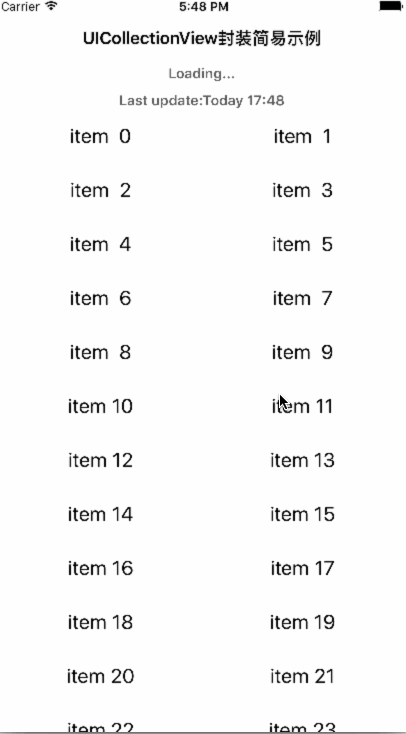

# ListDemo

演示：

基于UICollectionView的列表的实现，看似复杂，但分解之后就是如下的四个部分的文件，而且为了方便重用，做了更为细化的分解。
### 1. 配置文件
1. Layout

	1. 主要实现list中cell，footer、header、section的布局。即自定义的layout（系统提供flowlayout亦可使用）

	3. 增删cell时的动画设置
	
2. DataSource
	
	1. 数据源，list展示的数据在此文件中保存（以数组的形式）
	1. 实现`UICollectionViewDataSource`协议,将必须的数据源方法通过block的形式返回，便于在引用处设置
	2. 实现插入、删除、reload等方法。引用处只需简单调用即可

3. Delegate

	1. 事件源：将点击、display、size返回等事件以block回调至引用处，方便配置
	2. 实现`LayoutDelegate `协议方法，提供Layout必要的布局数据

4. LayoutDelegate

	1. 通常放在`Layout`文件中，该协议继承自`UICollectionViewDelegate`协议
	2. 提供Layout必须的或者非必须的资源，如用来获取cell宽高、footer和header的size属性等

